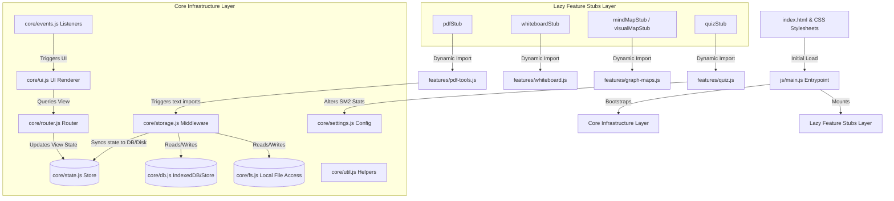

# NoteKash Codebase Developer Map & Architectural Index

Welcome! This document is the definitive developer map and architectural index of the NoteKash application. It serves as a unified blueprint for developers and AI coding assistants to easily locate files, understand the execution paths, modify components safely, and avoid design regressions.

---

## 🏗️ 1. High-Level Architectural Flow & Connection Map

NoteKash is structured as an offline-first, client-side Progressive Web Application (PWA). Rather than using single-page monolith structures, it separates core infrastructure from lazily-loaded features.

### 🗺️ System Interconnection Diagram



### ⏱️ System Startup & Initial Boot Lifecycle
1. **Stylesheet Download & Splash Rendering:**
   `index.html` loads all stylesheets in a predefined order. The critical CSS inside `styles/base.css` immediately displays the `#nk-shell-loader` graphic to prevent Flash of Unstyled Content (FOUC).
2. **ES Module Bootstrapping:**
   `js/main.js` is loaded as a native module. It synchronously imports and registers all core infrastructure scripts.
3. **App Namespace Setup:**
   `main.js` initializes `window.App` with all core modules and attaches dynamic stubs (like `App.quiz`, `App.pdf`) that proxy methods until the real features are lazily imported.
4. **Viewport Adjustment & Listener Setup:**
   The `DOMContentLoaded` event triggers, applying `.mobile-view` to the document body if window width is $\le 612\text{px}$. Global document-level keyboard and click listeners are wired via `App.events.setupGlobalListeners()`.
5. **Storage & Directory Permission Handlers:**
   `App.init()` checks IndexedDB for a saved local directory handle (`directory`).
   *   **Directory Access Allowed (Folder Storage Mode):** Fires `nk:ready` event (hiding the startup loader), opens a file system session via `App._startFileSystemSession()`, syncs directory files, and routes to **Library View** (`App.router.navigateTo('library')`).
   *   **Welcome Screen Redirection:** If no folder handle is found or the last mode was not set to browser, routes to **Welcome Screen** (`App.router.navigateTo('welcome')`) to prompt the user to choose their preferred storage layout (Local Folder vs. Sandbox Browser Storage).

---

## 🗃️ 2. Core Directory & Module Index

### 📁 Core Infrastructure Layer (`/js/core/`)

These files remain in browser memory for the entire session lifecycle and manage storage, routing, event mappings, and state:

| File Name | Global Hook | Responsibility | Key Interactions & Dependencies |
| :--- | :--- | :--- | :--- |
| [config.js](file:///Users/hakintosh/Documents/thisfile/cursor/js/core/config.js) | `App.config` | System-wide defaults, markdown shortcuts, category options, and fallback constants. | Read by `settings.js` and `main.js`. |
| [state.js](file:///Users/hakintosh/Documents/thisfile/cursor/js/core/state.js) | `App.state` | Single source of truth for UI state, current active article, loaded lists, and synchronization status. | Updated by `router.js` and `storage.js`; read by `ui.js`. |
| [db.js](file:///Users/hakintosh/Documents/thisfile/cursor/js/core/db.js) | `App.indexedDB`<br>`App.browserStore` | Manages local IndexedDB storage, handles OPFS directory handle persistence, and fallbacks to browser-isolated sandbox tables. | Core dependency of `storage.js`. |
| [fs.js](file:///Users/hakintosh/Documents/thisfile/cursor/js/core/fs.js) | `App.fs` | Interfaces with browser File System Access APIs to read/write raw `.json` files directly to local disk. | Relied upon by `storage.js` and `services.js`. |
| [events.js](file:///Users/hakintosh/Documents/thisfile/cursor/js/core/events.js) | `App.events` | Orchestrates all DOM event delegations, keyboard shortcuts, swipe listeners, and triggers actions globally. | Directly binds elements and dispatches to `ui.js`, `router.js`, and lazy stubs. |
| [router.js](file:///Users/hakintosh/Documents/thisfile/cursor/js/core/router.js) | `App.router` | Simple SPA hash-router. Toggles visibility classes (`.active`, `.hidden`) on view containers. | Sets `App.state.activeView` and triggers `App.ui.renderView()`. |
| [ui.js](file:///Users/hakintosh/Documents/thisfile/cursor/js/core/ui.js) | `App.ui` | Implements DOM template rendering, toast alerts, custom modal boxes, theme transitions, and content views. | Interacts heavily with `events.js` and updates DOM elements. |
| [util.js](file:///Users/hakintosh/Documents/thisfile/cursor/js/core/util.js) | `App.util` | Global helper module containing date formatters, HTML sanitization routines, SM2 flashcard calculation algorithms, and icon templates. | Called by almost every module in the application. |
| [services.js](file:///Users/hakintosh/Documents/thisfile/cursor/js/core/services.js) | `App.services` | Directs external integrations (AI completes, Markdown PDF compilation, file exports, and zip backups). | Loads `pdfmake`/`vfs_fonts` lazily; depends on `settings.js`. |
| [storage.js](file:///Users/hakintosh/Documents/thisfile/cursor/js/core/storage.js) | `App.storage` | Handles note persistence (creates, reads, updates, and deletes) across memory, index files (`_index.json`), and physical database/filesystems. | Connects `fs.js` and `db.js` to runtime `state.js`. |
| [settings.js](file:///Users/hakintosh/Documents/thisfile/cursor/js/core/settings.js) | `App.settings` | Getters and setters for user settings (e.g. active theme, category configurations, cloud options). | Persistent settings map backed by local storage. |
| [content-tools.js](file:///Users/hakintosh/Documents/thisfile/cursor/js/core/content-tools.js) | `App.contentTools` | Controls formatting utilities inside the active note editor (cloze generation, tag highlights, and list operations). | Operates directly on the `#article-content` editor container. |

---

### 📁 Feature Modules & Lazy Loading (`/js/features/`)

These larger features are stubbed at startup in [js/main.js](file:///Users/hakintosh/Documents/thisfile/cursor/js/main.js). The actual module files are downloaded lazily only when the feature is opened:

```javascript
// Example: Staged loading flow
App.router.navigateTo('quiz') 
  --> App.ui.renderView('flashcard') 
  --> App.quiz.start() 
  --> stub._loadReal() imports './features/quiz.js'
```

| Module File | Namespace Hook | CSS Stylesheet | Key Interactions & DOM Elements |
| :--- | :--- | :--- | :--- |
| [command-palette.js](file:///Users/hakintosh/Documents/thisfile/cursor/js/features/command-palette.js) | `App.commandPalette` | [styles/ai-magic.css](file:///Users/hakintosh/Documents/thisfile/cursor/styles/ai-magic.css) | Global command launcher and file switcher. Modal ID: `#command-palette`. |
| [splitscreen.js](file:///Users/hakintosh/Documents/thisfile/cursor/js/features/splitscreen.js) | `App.splitScreen` | [styles/editor.css](file:///Users/hakintosh/Documents/thisfile/cursor/styles/editor.css) | Splits editor viewport into multi-note frames. Triggers layout class `.split-iframe-mode`. |
| [quiz.js](file:///Users/hakintosh/Documents/thisfile/cursor/js/features/quiz.js) | `App.quiz` | [styles/flashcards.css](file:///Users/hakintosh/Documents/thisfile/cursor/styles/flashcards.css) | Flashcard learning sessions. Controls interactive grading buttons in `.study-session-modal`. |
| [whiteboard.js](file:///Users/hakintosh/Documents/thisfile/cursor/js/features/whiteboard.js) | `App.whiteboard` | [styles/whiteboard.css](file:///Users/hakintosh/Documents/thisfile/cursor/styles/whiteboard.css) | Canvas drawing layer, image occlusions, shape annotations. Renders onto `#whiteboard-overlay`. |
| [graph-maps.js](file:///Users/hakintosh/Documents/thisfile/cursor/js/features/graph-maps.js) | `App.mindMap`<br>`App.visualMap` | [styles/graph-maps.css](file:///Users/hakintosh/Documents/thisfile/cursor/styles/graph-maps.css) | 3D Node Graphs mapping tag links. Loads `d3.js` lazily; targets `#mindmap-canvas-container`. |
| [pdf-tools.js](file:///Users/hakintosh/Documents/thisfile/cursor/js/features/pdf-tools.js) | `App.pdf` | [styles/pdf-viewer.css](file:///Users/hakintosh/Documents/thisfile/cursor/styles/pdf-viewer.css) | PDF renderer and editor annotations. Loads `pdf.js` worker; container ID: `#pdf-viewer-container`. |
| [audio-engine.js](file:///Users/hakintosh/Documents/thisfile/cursor/js/features/audio-engine.js) | `App.audio` | [styles/audio-write.css](file:///Users/hakintosh/Documents/thisfile/cursor/styles/audio-write.css) | Speech-to-text recording, transcriptions, and wave player visualizer. Binds to `.audio-player-wrapper`. |
| [dropbox.js](file:///Users/hakintosh/Documents/thisfile/cursor/js/features/dropbox.js) | `App.dropbox` | *Logic only* | Syncs user folder updates with cloud storage. Triggered from Settings modal buttons. |
| [search.js](file:///Users/hakintosh/Documents/thisfile/cursor/js/features/search.js) | `App.globalSearch`<br>`App.find` | [styles/mobile.css](file:///Users/hakintosh/Documents/thisfile/cursor/styles/mobile.css) | Local note queries, Fuse.js index builder. Operates on `#search-input`. |

---

## 🎨 3. CSS Directory & Cascading Glossary

To prevent layout breakages and maintain style rules, stylesheets are loaded sequentially. Follow this index:

1. [themes.css](file:///Users/hakintosh/Documents/thisfile/cursor/styles/themes.css)
   *   **Role**: Base CSS custom properties (colors, fonts, light/dark/sepia configurations) matching `:root`.
2. [base.css](file:///Users/hakintosh/Documents/thisfile/cursor/styles/base.css)
   *   **Role**: CSS resets, custom scrollbars, animations, and the critical **startup shell loader overlay** style rules.
3. [editor.css](file:///Users/hakintosh/Documents/thisfile/cursor/styles/editor.css)
   *   **Role**: Text editor view styling, split-screen panels, Newspaper columns, and markdown rendering options.
4. [presentation-mode.css](file:///Users/hakintosh/Documents/thisfile/cursor/styles/presentation-mode.css)
   *   **Role**: teleprompter modules, spotlight highlights, and full-screen bento-grid presentation cards.
5. [whiteboard.css](file:///Users/hakintosh/Documents/thisfile/cursor/styles/whiteboard.css)
   *   **Role**: Drawing canvas shapes, toolbox panels, drag selectors, and occlusion cards.
6. [flashcards.css](file:///Users/hakintosh/Documents/thisfile/cursor/styles/flashcards.css)
   *   **Role**: Spaced repetition widgets, card flip animations, progress dials, and Zen mode interfaces.
7. [layout.css](file:///Users/hakintosh/Documents/thisfile/cursor/styles/layout.css)
   *   **Role**: Grid containers for main views, sidebars, header navigation controls, and export interfaces.
8. [ai-magic.css](file:///Users/hakintosh/Documents/thisfile/cursor/styles/ai-magic.css)
   *   **Role**: AI viewer popups, sidebar logs, upsell prompts, and command palette windows.
9. [mcq-study.css](file:///Users/hakintosh/Documents/thisfile/cursor/styles/mcq-study.css)
   *   **Role**: Multiple-choice study selectors, test card containers, and category list layout tables.
10. [welcome-screen.css](file:///Users/hakintosh/Documents/thisfile/cursor/styles/welcome-screen.css)
    *   **Role**: Ambient background gradients, grid tiles, typewriter containers, and storage configuration cards.
11. [mobile.css](file:///Users/hakintosh/Documents/thisfile/cursor/styles/mobile.css)
    *   **Role**: Mobile media overrides (`@media (max-width: 612px)`) resetting panels, margins, and sidebars.
12. [ascension.css](file:///Users/hakintosh/Documents/thisfile/cursor/styles/ascension.css)
    *   **Role**: Licensing tiers cards, donation modal content, lock overlay screens.
13. [audio-write.css](file:///Users/hakintosh/Documents/thisfile/cursor/styles/audio-write.css)
    *   **Role**: Player interfaces, audio waveform canvas, recording states.
14. [pdf-viewer.css](file:///Users/hakintosh/Documents/thisfile/cursor/styles/pdf-viewer.css)
    *   **Role**: PDF document container, page-flip selectors, annotations markers.
15. [pro-presenter.css](file:///Users/hakintosh/Documents/thisfile/cursor/styles/pro-presenter.css)
    *   **Role**: Luminescent borders, animated buttons, ambient aura layouts.

---

## 🔄 4. Data Flow & State Lifecycle

```
[User Edits Note] 
  --> contentEditable DOM updates
  --> Events (events.js) catches keystroke (debounce 400ms)
  --> State (state.js) updates activeArticle in memory
  --> Storage (storage.js) intercepts dirty state
  --> Disk Sync (fs.js / db.js) writes to active JSON file & regenerates _index.json
  --> Sync Trigger (dropbox.js) runs delta comparison if online
```

### 💾 Storage Synchronization Details
*   **Browser Mode:** Notes are stored as key-value pairs in IndexedDB. Saving updates the database records asynchronously.
*   **Folder Mode:** Notes are stored as `<id>.json` files inside the chosen directory. An index ledger `_index.json` stores article metadata (titles, tags, category, word count) to enable fast searching and filtering in the library view without loading all note contents on boot.

---

## ⚠️ 5. Inter-dependency Warning Matrix (Safety Checklist)

To ensure zero regressions when modifying the codebase, refer to this dependency warning list:

*   **If you modify [service-worker.js](file:///Users/hakintosh/Documents/thisfile/cursor/service-worker.js):**
    Always check that all files in `APP_SHELL` exist. Any missing file will break service worker installations entirely.
*   **If you add or rename assets (JS/CSS):**
    You **must** update the `APP_SHELL` array in [service-worker.js](file:///Users/hakintosh/Documents/thisfile/cursor/service-worker.js) and increment `CACHE_VERSION` to force client updates.
*   **If you load new external scripts dynamically in [lazy-loader.js](file:///Users/hakintosh/Documents/thisfile/cursor/js/core/lazy-loader.js):**
    Avoid using a `globalName` check if the target script is an anonymous extension of an already existing namespace (like `pdfmakeFonts` extending `window.pdfMake`). Otherwise, the loader will skip fetching the file if the base library is already loaded.
*   **If you change active state parameters in [state.js](file:///Users/hakintosh/Documents/thisfile/cursor/js/core/state.js):**
    Verify the split-screen iframe handler inside [splitscreen.js](file:///Users/hakintosh/Documents/thisfile/cursor/js/features/splitscreen.js#L296) still receives the exact initialization flags it expects (`App.state.isDataFullyLoaded`, `App.state.articles`, etc.).
*   **If you modify [ui.js](file:///Users/hakintosh/Documents/thisfile/cursor/js/core/ui.js) views:**
    Ensure elements that participate in keyboard shortcuts (like `#resume-btn` or `#select-folder-btn` inside the welcome screen) retain their unique IDs so `events.js` keyboard listener can target them.

---

## 🛠️ 6. Guide: How to Safely Modify Code & Avoid Regression

### Step 1: Identify the Target Module
Determine which JavaScript module and CSS stylesheet own the feature using the tables above.
*Example: If you need to fix a rendering error in the quiz, you should work in [quiz.js](file:///Users/hakintosh/Documents/thisfile/cursor/js/features/quiz.js) and [styles/flashcards.css](file:///Users/hakintosh/Documents/thisfile/cursor/styles/flashcards.css).*

### Step 2: Trace the Event Flow
Ensure you do not bind inline event handlers (`onclick="..."`) dynamically if they belong to global infrastructure. Global click and keyboard delegations should be wired through [events.js](file:///Users/hakintosh/Documents/thisfile/cursor/js/core/events.js)'s `setupGlobalListeners()` block.

### Step 3: Local Development Sandbox Verification
To test changes safely:
1. Fire up a local development web server:
   ```bash
   python3 -m http.server 8080
   ```
2. Navigate to `http://localhost:8080/index.html`.
3. Open Chrome DevTools and check the console logs for any unhandled reference exceptions or service worker update actions.
